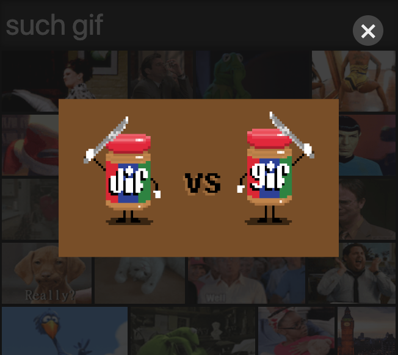

# giphy-signal

> A small Giphy browser

A list of Giphy's trending GIFs and a search bar that allows you to search for
GIFs and then view them in full-screen mode.

## Development

Clone the repository and install dependencies with `npm install`.

Before you start the app, get a Giphy API key and store it in the environment
varibale `REACT_APP_GIPHY_API_KEY`.

Then start the app with `npm start` and open
[http://localhost:3000](http://localhost:3000) in a browser.

## Testing

This app has tests for components, actions and reducers. You can run all of the
tests with `npm test`. To check test coverage, you can use `npm run coverage`.

## Deployment

This app can be quickly [deployed with Heroku](https://medium.com/@WebDevRaj/deploy-a-react-app-on-heroku-the-right-way-e17333d29169).
Don't forget to store the Giphy API key in the `REACT_APP_GIPHY_API_KEY`
environment variable.

## License

[GPLv3](http://www.gnu.org/licenses/gpl-3.0.html)
